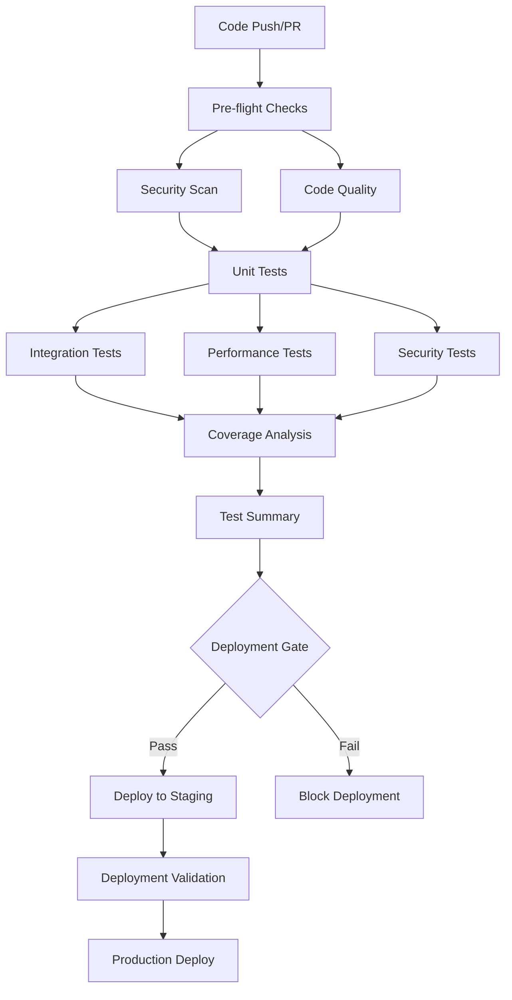

# CI/CD Pipeline Integration Guide

## Overview

This document describes the comprehensive CI/CD pipeline integration for the Universal RAG CMS Testing Framework. The pipeline includes automated test execution, coverage reporting, performance regression detection, security scanning, and deployment gates.

## Pipeline Architecture

### 🔄 Workflow Structure



## Workflows

### 1. Main CI/CD Pipeline (`universal_rag_cms_ci.yml`)

**Triggers:**
- Push to `main`, `master`, `develop` branches
- Pull requests to `main`, `master`, `develop` branches
- Manual workflow dispatch

**Jobs:**

#### 🔍 Pre-flight Checks
- Validates configuration files
- Checks for relevant file changes
- Determines if tests should run

#### 🔒 Security & Dependency Scan
- **Safety**: Checks for known security vulnerabilities in dependencies
- **Bandit**: Static security analysis for Python code
- **Semgrep**: Additional security pattern detection

#### 📊 Code Quality Analysis
- **Black**: Code formatting validation
- **isort**: Import sorting validation
- **Flake8**: Linting and style checks
- **MyPy**: Type checking

#### 🧪 Unit Tests
- Runs across Python 3.9, 3.10, 3.11
- Coverage threshold enforcement (configurable, default 80%)
- Parallel execution with pytest-xdist
- Timeout protection (5 minutes per test)

#### 🔗 Integration Tests
- PostgreSQL and Redis services
- Real database connections
- API integration testing
- Extended timeout (10 minutes)

#### ⚡ Performance Tests
- Benchmark execution with pytest-benchmark
- Memory profiling
- Performance regression detection
- Extended timeout (20 minutes)

#### 🛡️ Security Tests
- Security-specific test suite
- Authentication and authorization testing
- Input validation testing

#### 📈 Coverage Analysis
- Combines coverage from all test runs
- Generates HTML and XML reports
- Creates coverage badges
- Comments on PRs with coverage details

#### 🚀 Deployment Gate
- Evaluates all test results
- Creates deployment tags for successful builds
- Blocks deployment on critical failures

### 2. Performance Regression Detection (`performance_regression.yml`)

**Purpose**: Detects performance regressions by comparing current performance against baseline.

**Features:**
- Baseline performance measurement
- Current branch performance testing
- Statistical analysis of performance changes
- Visual charts and reports
- Configurable regression thresholds (default 10%)
- PR comments with detailed analysis

**Workflow:**
1. **Performance Baseline**: Tests baseline branch performance
2. **Current Performance**: Tests current branch performance
3. **Regression Analysis**: Compares results and generates reports
4. **Performance Trends**: Stores historical data for trend analysis

### 3. Coverage Enforcement (`coverage_enforcement.yml`)

**Purpose**: Ensures code coverage meets minimum thresholds and provides detailed coverage reporting.

**Features:**
- Configurable coverage thresholds
- Module-level coverage analysis
- Coverage diff between branches
- Automated badge generation
- Detailed uncovered lines reporting

**Jobs:**
- **Coverage Analysis**: Runs tests with coverage collection
- **Coverage Diff**: Compares PR coverage against base branch
- **Coverage Enforcement**: Fails build if coverage below threshold
- **Badge Updates**: Updates coverage badges in README

### 4. Deployment Validation (`deployment_validation.yml`)

**Purpose**: Validates deployments through health checks and smoke tests.

**Features:**
- Health endpoint monitoring
- API endpoint validation
- Response time testing
- Security header checks
- SSL/TLS validation
- Load testing (basic)

## Configuration

### Environment Variables

```yaml
# Default Python version
PYTHON_VERSION: '3.11'

# Coverage threshold (percentage)
COVERAGE_THRESHOLD: '80'

# Performance regression threshold (percentage)
REGRESSION_THRESHOLD: '10'

# Test suite selection
TEST_SUITE: 'all'  # Options: all, unit, integration, performance, security
```

### Secrets Required

```yaml
# Test API keys (for integration tests)
TEST_OPENAI_API_KEY: "sk-..."
TEST_ANTHROPIC_API_KEY: "sk-ant-..."
TEST_SUPABASE_URL: "https://..."
TEST_SUPABASE_KEY: "eyJ..."

# Deployment validation
DEPLOYMENT_API_KEY: "..."
MONITORING_WEBHOOK: "https://..."

# GitHub token (for badge updates)
GITHUB_TOKEN: "ghp_..."
```

## Test Markers

The pipeline uses pytest markers to categorize tests:

```python
@pytest.mark.unit
def test_unit_functionality():
    """Unit test - fast, isolated"""
    pass

@pytest.mark.integration
def test_integration_workflow():
    """Integration test - with external services"""
    pass

@pytest.mark.performance
def test_performance_benchmark():
    """Performance test - with benchmarking"""
    pass

@pytest.mark.security
def test_security_validation():
    """Security test - authentication, authorization"""
    pass

@pytest.mark.slow
def test_slow_operation():
    """Slow test - may take several minutes"""
    pass

@pytest.mark.smoke
def test_basic_functionality():
    """Smoke test - basic functionality validation"""
    pass
```

## Deployment Gates

### Criteria for Deployment Approval

✅ **Required for Deployment:**
- Unit tests pass on all Python versions
- Integration tests pass
- Security scan passes (no critical vulnerabilities)
- Code quality checks pass
- Coverage meets minimum threshold

⚠️ **Warning but Not Blocking:**
- Performance tests (unless significant regression)
- Security tests (non-critical findings)
- Code quality warnings (non-error level)

### Deployment Environments

1. **Staging**: Automatic deployment on successful CI
2. **Production**: Manual approval required after staging validation

## Artifacts and Reports

### Generated Artifacts

- **Test Results**: JUnit XML files for all test suites
- **Coverage Reports**: HTML, XML, and JSON coverage reports
- **Performance Reports**: Benchmark results and regression analysis
- **Security Reports**: Vulnerability scans and security test results
- **Quality Reports**: Code quality analysis results

### Retention Policies

- **Test Results**: 30 days
- **Coverage Reports**: 30 days
- **Performance History**: 90 days (for trend analysis)
- **Security Reports**: 90 days
- **Deployment Reports**: 90 days

## Performance Monitoring

### Metrics Tracked

- **Test Execution Time**: Total time for each test suite
- **Coverage Percentage**: Overall and per-module coverage
- **Performance Benchmarks**: Response times, throughput
- **Security Scan Results**: Vulnerability counts and severity
- **Deployment Success Rate**: Percentage of successful deployments

### Trend Analysis

The pipeline maintains historical data for:
- Performance benchmarks over time
- Coverage trends
- Test execution time trends
- Security vulnerability trends

## Troubleshooting

### Common Issues

#### 1. Coverage Below Threshold
```bash
# Check which files need more coverage
cd tests
python -m pytest --cov=../src --cov-report=html
# Open htmlcov/index.html to see detailed coverage
```

#### 2. Performance Regression
```bash
# Run performance tests locally
cd tests
python -m pytest -m "performance" --benchmark-only
```

#### 3. Integration Test Failures
```bash
# Check service dependencies
docker-compose up postgres redis
# Run integration tests
python -m pytest -m "integration" -v
```

#### 4. Security Scan Issues
```bash
# Run security tools locally
pip install safety bandit
safety check
bandit -r src/
```

### Debug Mode

Enable debug mode by setting environment variables:

```yaml
env:
  DEBUG_MODE: 'true'
  VERBOSE_LOGGING: 'true'
```

## Best Practices

### 1. Test Organization
- Keep unit tests fast (< 1 second each)
- Use appropriate test markers
- Mock external dependencies in unit tests
- Use real services only in integration tests

### 2. Performance Testing
- Establish baseline performance early
- Set realistic regression thresholds
- Monitor trends over time
- Profile slow tests regularly

### 3. Coverage Management
- Aim for high coverage but focus on quality
- Exclude generated files from coverage
- Test edge cases and error conditions
- Document any intentionally uncovered code

### 4. Security Testing
- Include security tests in regular runs
- Test authentication and authorization
- Validate input sanitization
- Check for common vulnerabilities

## Maintenance

### Regular Tasks

1. **Weekly**: Review performance trends and coverage reports
2. **Monthly**: Update dependency versions and security tools
3. **Quarterly**: Review and update test thresholds
4. **Annually**: Audit entire pipeline configuration

### Monitoring

- Set up alerts for pipeline failures
- Monitor test execution times
- Track coverage trends
- Review security scan results

## Integration with External Tools

### GitHub Features
- **Status Checks**: Required for PR merging
- **Branch Protection**: Enforce pipeline success
- **Deployment Environments**: Staging and production gates

### Monitoring Tools
- **Webhook Integration**: Send results to monitoring systems
- **Slack/Teams**: Notifications for failures
- **Email Alerts**: Critical failure notifications

## Migration Guide

### From Existing CI/CD

1. **Assessment**: Audit current pipeline
2. **Gradual Migration**: Implement workflows incrementally
3. **Parallel Running**: Run old and new pipelines together
4. **Validation**: Ensure equivalent or better coverage
5. **Cutover**: Switch to new pipeline completely

### Rollback Plan

1. **Backup**: Keep old pipeline configuration
2. **Feature Flags**: Use feature flags for gradual rollout
3. **Quick Revert**: Ability to quickly revert to old pipeline
4. **Documentation**: Clear rollback procedures

## Future Enhancements

### Planned Features

1. **Advanced Analytics**: More detailed performance analytics
2. **AI-Powered Testing**: Intelligent test generation
3. **Cross-Platform Testing**: Windows and macOS runners
4. **Mobile Testing**: Mobile app testing integration
5. **Chaos Engineering**: Fault injection testing

### Scalability Improvements

1. **Parallel Execution**: More granular parallelization
2. **Caching**: Intelligent dependency caching
3. **Resource Optimization**: Dynamic resource allocation
4. **Cost Optimization**: Efficient runner usage

---

## Support

For questions or issues with the CI/CD pipeline:

1. **Documentation**: Check this guide and workflow comments
2. **Issues**: Create GitHub issues for bugs or feature requests
3. **Discussions**: Use GitHub Discussions for questions
4. **Team**: Contact the development team for urgent issues

---

*Last Updated: $(date)*
*Version: 1.0* 